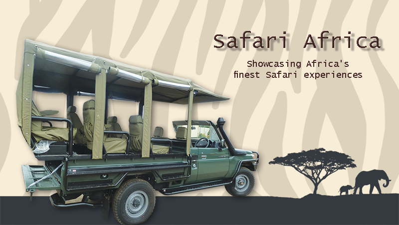
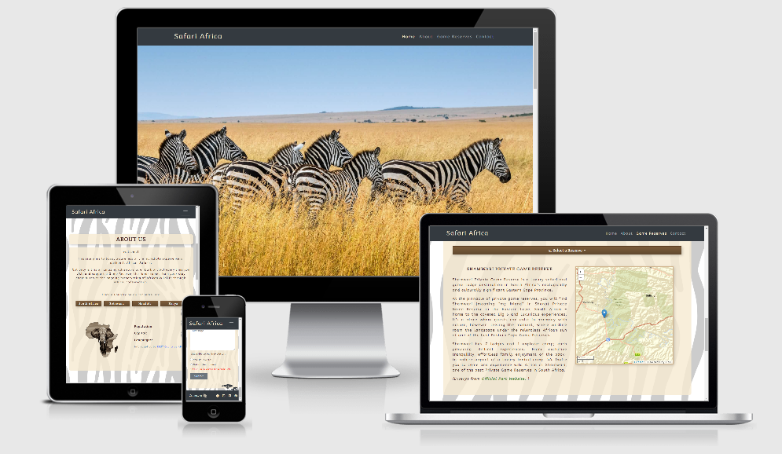
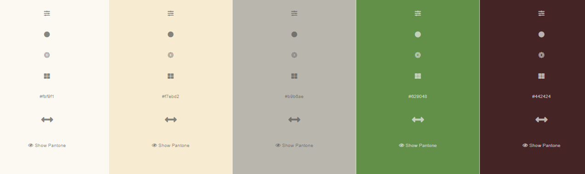

# Safari Africa

[LIVE SITE ON GITHUB PAGES](https://jimlynx.github.io/CI-MS2-Safari-Africa/)

The aim of this project is to highlight a selection of Game Reserves in each of the 4 prominent Safari destination countries in Southern Africa.

### Table of Contents

> - [Overview](#overview)
> - [User Stories](#user-stories)
> - [UX](#ux)
> - [Features](#features)
> - [Technologies Used](#technologies-used)
> - [References for learning](#references-for-learning)
> - [Testing](#testing)
> - [Project barriers and solutions](#project-barriers-and-solutions)
> - [Code validity](#code-validity)
> - [Version Control](#version-control)
> - [Deployment](#deployment)
> - [Credits](#credits)
> - [Acknowledgments](#acknowledgments)
> - [Support](#support)

**Please note: To open any links in this document in a new browser tab, please press `CTRL + Click`.**

### Overview

> The aim of this project is to showcase Safari and Game Reserve destinations to promote tourism back to the areas after the COVID-19 lock-downs.

---

#### User Stories

> - _"I don't have a PC or Laptop at home and generally do all my online searches on my mobile"_
> - _"I want to get an idea of where the best reserves are"_
> - _"I want to be able to subscribe to a mailing list about future projects"_
> - _"I want to get in touch with some unanswered questions about reserves"_
> - _"I want to be able to join a community forum or social media group to see some of the past safaris run, and get regular updates"_
> - _"I am interested in taking part in a trip, but would like to see some reviews first"_

---

### UX

This website project will target a large demographic of individuals and families from all walks of life, hence an overall simple, yet effective website is aimed at. The priority focus is on information, maps, subscribing to a mailing list, contact and social media links.

---

#### 1. Strategy

> The UX is clean and user-friendly and provides an easy navigation journey to reach relevant sections with ease.
>
> ##### Project Goals:
>
> - Showcase the top 3 game reserves in 4 of Southern Africa's most well-renowned Safari destination countries.
> - Promoting game reserves by showcasing the best they have to offer.
> - Obtaining subscriptions for mailing list, thereby increasing customer databases.
> - Direction to Facebook Group links for each reserve, expanding on their group numbers.
>
> ##### Customer Goals:
>
> - Designed site with Mobile-first approach.
> - Display interactive maps for each country and each reserve within each country
> - Contact form provided with option to sign up for mailing list.
> - Relevant Social Media icons in the footer and links in reserve pages.
> - Fixed navigation bar providing user easy navigation reference.
> - Review API (Stretch goal)

#### 2. Scope

> - Provides a clean UX for users with easy navigation.
> - Fits in with my current skill-set of HTML, CSS, JavaScript and API use.
> - Quickly defines the content and focus on images and maps, subscribing to a mailing list and getting in touch via email or social media.
> - I've included some JavaScript animations to subtly enhance the overall experience without overpowering the page.

#### 3. Structure

> The main focus of the structure is to allow Users to quickly assimilate the information, maps and imagery.
> Short, focused paragraphs of content information to provide enough information, yet not overwhelm.
> A selection of quality images to showcase the game reserves.
> Points of contact are provided via email contact form (with newsletter subscription option) and links to Social Media in Footer.

#### 4. Skeleton

> - [Wireframes](assets/docs/wireframes.pdf): One-page website with **4** main sections.
> - Fixed navigation bar - Menu headings pointing to each of the 4 pages.
> - Home, About, Reserves and Contact pages
> - Footer with Copyright info and Social Media icons
> - (Add Country info via API - stretch goal dependent on time) - Stretch goal completed - Country REST API Info presented on About section.
> - (Review API section - stretch goal)

---

#### 5. Surface

> ###### Colours
>
> Nature/Safari colours to fit in with the theme of wildlife conservation
>
> 
>
> ###### Typography
>
> - "Crete Round" font (with fall-back font of Serif) for main headings. This font was chosen for its typical 'Safari' look.
> - "ABeeZee" font (with fall-back font of Sans-Serif) for body content which I found clean and balanced and not too formal.
>
> ###### Images
>
> The image selection has been carefully considered to best showcase each reserve.
>
> ###### Maps
>
> Interactive maps with smooth transitions to each location
> Additional reserve info on map markers

---

### Features

##### Existing Features

> - Designed with HTML5, CSS3, JavaScript and Bootstrap.
> - Home/Landing page with 4 pages in total.
> - Fixed navigation allows the user to easily navigate, regardless of which page visited.
> - Fixed footer allows the user quick accessibility to social media links.
> - Contact Form with radio buttons.

##### Features Left to Implement when skills develop

> -

---

### Technologies Used

##### 1. Languages

>  [HTML5](https://en.wikipedia.org/wiki/HTML5)
>
>  [CSS3](https://en.wikipedia.org/wiki/Cascading_Style_Sheets)
>
>  [JavaScript](https://en.wikipedia.org/wiki/JavaScript)

##### 2. Integration

>  [Bootstrap](https://getbootstrap.com/) - by linking via [Bootstrap CDN](https://www.bootstrapcdn.com/) to HTML Doc.
>
>  [FontAwesome](https://fontawesome.com/) Icons for Social Media links in Footer.
>
>  [Google Fonts](https://fonts.google.com/) - Overall Typography import.
>
>  [jQuery](https://jquery.com/) - JavaScript library
>
>  [LeafletJS](https://leafletjs.com/) - Interative Maps API
>
>  [REST Countries](https://restcountries.eu/) - REST Country info API  

##### 3. Workspace, version control and Repository storage

>  [VSCode](https://code.visualstudio.com/) - Main workspace IDE (Integrated Development Environment)
>
>  [Git](https://git-scm.com/) - Distributed Version Control tool to store versions of files and track changes.
>
>  [GitHub](https://github.com/) - A cloud-based hosting service to manage my **Git** repositories.

##### 4. Other

> - [Autoprefixer](https://autoprefixer.github.io/) Parses CSS and adds vendor prefixes.
> - [Google Mobile-Friendly Test](https://search.google.com/test/mobile-friendly) Mobile-friendly check on site.
> - [Website Page Test](https://www.webpagetest.org/) Runs a website speed test from multiple locations around the globe using real browsers (IE and Chrome) and at real consumer connection speeds.
> - [Online-Spellcheck](https://www.online-spellcheck.com/) Online spelling and grammar checks.

##### 5. IDE Extensions used in GitPod

> - Auto Close Tag
> - Auto Rename Nametag
> - Bracket Pair Colorizer
> - Code Spellchecker
> - Prettier - Code Formatter
> - Indent-Rainbow

---

### Resources

> - [Code Institute Course Content](https://courses.codeinstitute.net/) - Main source of fundamental knowledge.
> - Code Institute **SLACK Community** - Main source of assistance
> - [Stack Overflow](https://stackoverflow.com/) - General resource.
> - [Youtube](https://www.youtube.com/) - General resource.
> - [CSS-Tricks](https://css-tricks.com/) - General resource.
> - [W3.CSS](https://www.w3schools.com/w3css/4/w3.css) - General resource.
> - [CommonMark](https://commonmark.org/help/) - For Markdown language reference.
> - [iColorpalette](https://icolorpalette.com/imagepalette/color-palette-ideas-from-car-motor-vehicle-image-11) - Find relevant color palette for site.
> - [TinyPNG](https://tinypng.com/) - Efficient compression of images for site.
> - [Am I Responsive](http://ami.responsivedesign.is/) - Responsive website mockup image generator.
> - [Balsamiq](https://balsamiq.com/wireframes/) - Wireframing design tool.
> - [Bootstrap Grid Explanation by Anna Greaves](https://ajgreaves.github.io/bootstrap-grid-demo/) - This was an invaluable resource for me to wrap my head around Grid layouts.
> - [Tim Nelson's Github for LeafletJS](https://github.com/TravelTimN/ci-ifd-lead/tree/master/week4-leafletjs)

---

### Testing

> Testing documentation can be found on a separate document [HERE](assets/docs/Testing.md)

### Project barriers and solutions

> - Map pins were not removing after clicking reserve button, and then clicking a new country button. Had a screen-share session with Tim Nelson to try and resolve this. Need to research using Marker Clusters with LeafetJS - Updated: Tim found a fix for the existing code without necessitating marker clusters.
> - Existing layout for Country/Reserve section with maps was not as expected on mobile view as the UX was difficult to navigate. Overcame this by creating a new branch and testing a new layout using dropdown buttons for the main country and reserve buttons.
> - As above, found that when selecting a reserve (and then trying to scroll down to the info (under the map) it was finicky on mobile as the map is touch-responsive. This was interfering with usability and UX. Simply moved the map under the reserve info, which resolved the issue along with the dropdown box layout.
> - Was having issues with the live webcam player for Namibia, (for which the only available source is non-Youtube based). Replaced with live-stream from a South African waterhole for this section (to be looked and and try to resolve after project submission).
> - Had an issue with slideshow images all showing for 1 second before loading first image. After not finding a resolution and trying various functions, I overcame this by designing a pre-loading animation. This not only resolved the issue, but added a good intro and UX to the site.
>
---

### Code validity

> HTML - [W3C](https://validator.w3.org/) - Markup Validation
>
> CSS - [W3C](https://jigsaw.w3.org/css-validator/) - CSS Validation
>
> JavaScript - JSHINT
>
> TAGS - [Closing Tag Checker for HTML5](https://www.aliciaramirez.com/closing-tags-checker/) - Validates all tags are opening and closing correctly.

---

### Version Control

> - Used Git for version control.
> - Branches were created to work on alternative layout and buttons.
> - The branches were then merged with the master branch after any conflicts were addressed.

---

### Deployment

This project has been deployed on GitHub Pages with the following process:

> - All code was written on VSCode, a local IDE (Integrated Development Environment).
> - The code was then pushed to GitHub where it is stored in my [Repository](https://github.com/JimLynx/CI-MS2-Safari-Africa).
> - Under the Settings section of the GitHub repository, scrolled down to GitHub Pages section.
> - Under 'Source' drop-down, the 'Master branch' was selected.
> - Once selected, this publishes the project to GitHub Pages and displays the site URL.
> - There is no difference between the deployed version and the development version.
> - The code can be run locally through clone or download.
> - You can do this by opening the repository, clicking on the green 'Code' button and selecting either 'clone or download'.
> - The Clone option provides a URL, which you can use on your desktop IDE.
> - The Download ZIP option provides a link to download a ZIP file which can be unzipped on your local machine.

### Credits

> ##### Media
>
> - Site background image from [Public Domain Pictures](https://www.publicdomainpictures.net/en/view-image.php?image=129300&picture=seamless-zebra-pattern)
> - Intro carousel images from [Unsplash](https://unsplash.com/)
> - About page image from [Graham Springer Fine Art](http://www.grahamspringer.com/)
> - Africa outline image from [Pintrest](https://www.pinterest.ie/pin/77616793558531466/)
> - Combination of above 2 images into final product - self-made on Photoshop
> - Reserve placeholder image and footer (edited for needs) taken image from [PNGFuel](https://www.pngfuel.com/)
> - Preload antelope animation .gif from [Icons8](https://icons8.com/preloaders/en/people_and_animals)

> ##### Content
>
> - Tim Nelsons's extensive documentation on LeafletJS Maps from his MS2 project
>
> ##### Bootstrap 4 CDN Boilerplate
>
> - I've taken advantage of _Simen Daehlin's_ template boilerplate from his [Marketplace](https://marketplace.visualstudio.com/items?itemName=eventyret.bootstrap-4-cdn-snippet)
>
> ##### Code Snippets
>
> - CSS: Main Country and Reserve Button styling - https://www.bestcssbuttongenerator.com/#/11*
> - Function by W3SCHOOLS - smooth scrolling (using Jquery)
> - Tim Nelson - Showing only map tiles for Southern Africa (avoid loading world map)
> - HTML, CSS & JavaScript: Intro carousel & transition function from [CSS Tricks](https://css-tricks.com/snippets/jquery/simple-auto-playing-slideshow/)
> - JavaScript: find by location in array of objects [Stack Overflow](https://stackoverflow.com/a/35398031/13484385*/)
> - iframe element 'stop on click' function help from John Traas (CI student) and final solution (due to stopVideo method no longer working on iframes) from [Stack Overflow](https://stackoverflow.com/a/30358006/14197670)

---

> ##### Acknowledgments
>
> I would like to thank:
>
> - My mentor, **Mark Railton** for his guidance and advice on this project before submission.
> - **Bim Williams** and **JoWings** for their continued support and guidance.
> - **Tim Nelson** for his wealth of knowledge on LeafletJS and taking the time to walk me through bugs experienced.
> - **James Lowe** for his help and patience in advice on the country API.
> - **John Traas** for his help with overcominmg the barrier with videos not stopping on button click.
> - **CI staff** and **Slack Community** for always being on-hand with questions posted and assistance requests.
> - Everyone that takes part in the Slack calls, specifically from the **#In-It-Together** and **#Study-Group** channels.

### Support

> For any issue resolution or assistance, please email Jim Morel on jim.lynx@gmail.com

---
